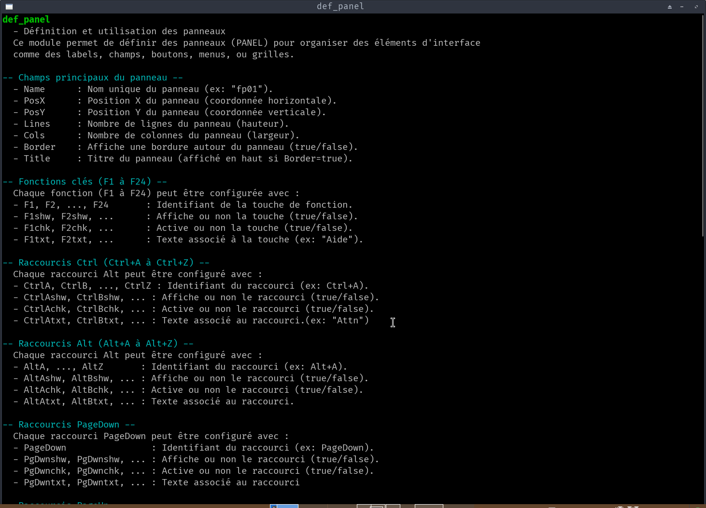
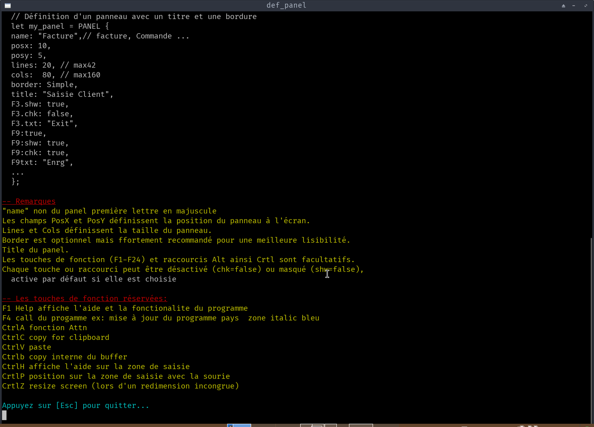

# 📜 GEN-DOC
petite application pour générer de la documentation 

**GEN-DOC** est une application en **Rust** qui permet de **générer, gérer et afficher de la documentation** pour tes projets.   
Elle utilise **GTK3** pour l'interface graphique et **VTE3** pour intégrer un terminal interactif.

---

---

## 📌 **Fonctionnalités**

✅ **Génération de documentation** : Crée des fichiers de documentation à partir de tes projets.   
✅ **Interface graphique** : Utilise **GTK3** pour une interface intuitive.   
✅ **Terminal intégré** : Intègre un terminal **VTE3** pour exécuter des commandes directement depuis l'application.   
✅ **Gestion des programmes autorisés** : Seuls les programmes définis dans `AUTHORIZED_PROGRAMS` peuvent être exécutés.   
✅ **Personnalisation** : Police, taille du terminal et autres paramètres configurables.   

---
# 📜 Terminal Integration (GTK3/VTE3)

Le module **`terminal.rs`** gère les **entrées/sorties dans un terminal GTK3/VTE3**. (TermDspDoc)  
Il permet d'intégrer un terminal interactif dans ton application **`gen_doc`** pour exécuter des commandes, afficher des résultats, et interagir avec l'utilisateur.    
  
Ce terminal est optimisé pour une intégration fluide .
Il respecte parfaitement les codes d'échappement (couleurs, curseur, etc.) et offre une expérience cohérente avec un éditeur type terminal.
  
---

## 🛠 **Installation**

### 1. **Prérequis**
Assure-toi d'avoir les dépendances suivantes installées sur ton système :

```
install gtk3 vte3
```
---

### 2. **Cloner le projet**
```bash
git clone https://github.com/as400jplpc/gen_doc.git
cd gen_doc
```
---

## 🚀 **Utilisation**

### **Lancer l'application**
```
voir  Menu.sh
```
- **`<GENDOC>`** :    
---


## 📂 **Structure du Projet**

```
`gen_doc/``
── BASE_HELP.txt
├── Cargo.lock
├── Cargo.toml			# Dépendances et configuration du projet
├── dltdoc				# Binaires compilés
├── dlt_doc.sh
├── dspdoc				# Binaires compilés
├── export_help.sh
├── gendoc				# Binaires compilés
├── gen_doc.sh
├── gen_help.sh
├── help_pgm.txt
├── lst_doc.sh
├── Menu.sh				# Point d'entrée de l'application
├── readme.md
├── sqlite
│   └── help_pgm.db
├── src
│   ├── bin
│   │   ├── dltdoc.rs
│   │   ├── dspdoc.rs
│   │   ├── gendoc.rs
│   │   └── TermDspDoc.rs
│   ├── lib.rs
│   └── terminal.rs		# Gestion du terminal et des commandes
└── TermDspDoc			# Binaires compilés Treminal GTK3-VTE3

---

---

## 🔧 **Configuration**
cargo add gtk@0.19
cargo add vte_sys
cargo add glib
cargo add libc
cargo add pango@0.19
cargo add once_cell


### **Programmes Autorisés**
Les programmes autorisés à être exécutés dans le terminal sont définis dans le code source :
```
const AUTHORIZED_PROGRAMS: &[&str] = &["dspdoc"];
```
- Pour ajouter un programme autorisé, modifie cette liste.

---

### **Répertoire de la Bibliothèque**
Le répertoire où sont stockés les programmes est défini par :
```
const PGM_LIB_DIR: &str = "/Zrust/gen_doc/";
```
- Modifie cette constante pour pointer vers ton répertoire de programmes.

---

### **Taille du Terminal**
La taille du terminal est définie par :
```
const TERMINAL_COLS: i64 = 132;
const TERMINAL_ROWS: i64 = 42;
```
- Ajuste ces valeurs selon tes besoins.

---

---

## 🐛 **Débogage**

### **les Logs**
L'application utilise des fonction interne avec log pour le débogage .
---

### **Problèmes Courants**
1. **Le terminal ne s'affiche pas** :
   - Vérifie que **VTE3** est bien installé (`libvte-2.91-dev`).
   - Vérifie que le programme autorisé (`dspdoc`) existe dans `PGM_LIB_DIR`.

2. **Erreur de compilation** :
   - Assure-toi que toutes les dépendances (`gtk`, `vte-sys`, etc.) sont bien installées et compatibles.

3. **Problème avec les chemins** :
   - Vérifie que `HOME` ou `USERPROFILE` est bien défini dans ton environnement.

---

---

## 🤝 **Contribution**

Les contributions sont les bienvenues ! Voici comment contribuer :

1. **Fork** le projet sur GitHub.
2. Crée une **branche** pour ta fonctionnalité (`git checkout -b ma_fonctionnalité`).
3. **Commit** tes changements (`git commit -m "Ajout de ma fonctionnalité"`).
4. **Push** vers la branche (`git push origin ma_fonctionnalité`).
5. Ouvre une **Pull Request**.

---
  
  

  
  
  

  
  
  
---

## 📜 **Licence**

Ce projet est sous licence  Voir le fichier [LICENSE](LICENSE) pour plus de détails.

---
---

### **📌 Points Clés du README**
1. **Fonctionnalités** : Décrit ce que fait l'application.
2. **Installation** : Étapes claires pour installer et exécuter.
3. **Utilisation** : Comment utiliser l'application.
4. **Structure du Projet** : Organisation des fichiers.
5. **Configuration** : Comment personnaliser l'application.
6. **Débogage** : Aide pour résoudre les problèmes courants.
7. **Contribution** : Comment contribuer au projet.
8. **Licence** : Informations légales.
  
  
  
remerciement  à IA de m'avoir aidé  Mistral  IA google  pour clarifier certaine fonction
>>>>>>> 8bf46c1 (maj_20260911_18:15)
